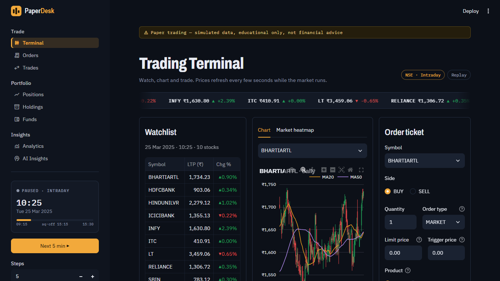
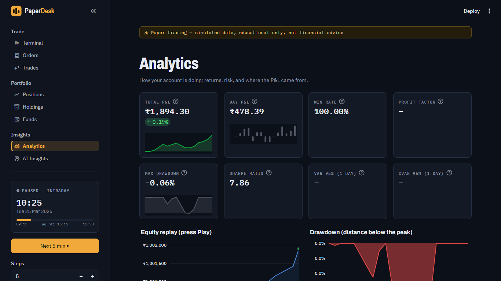
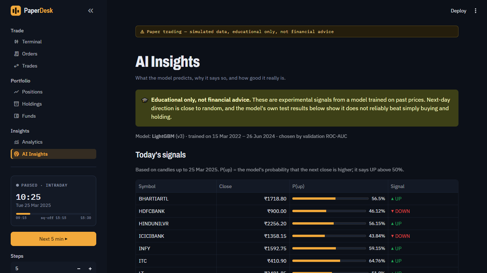
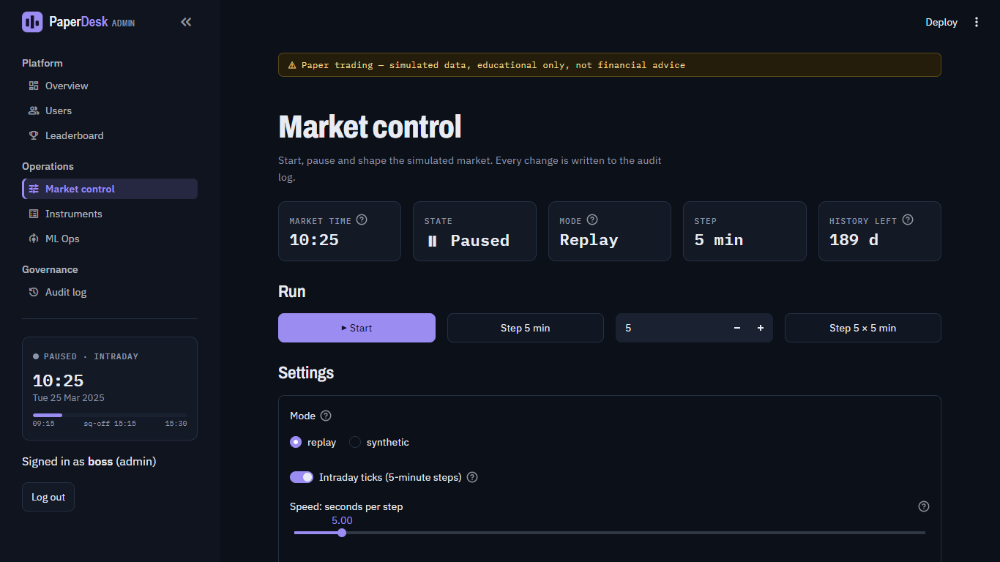
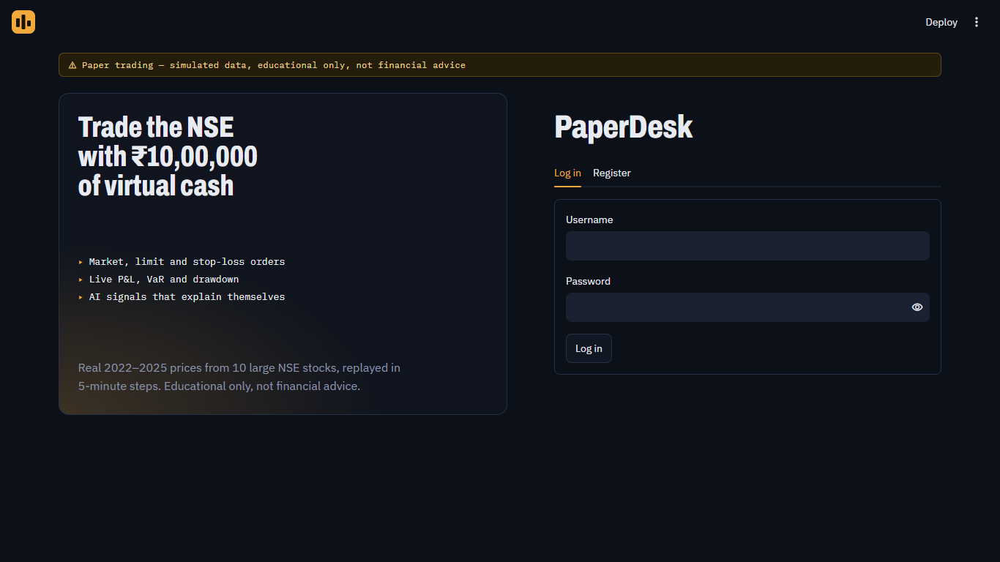
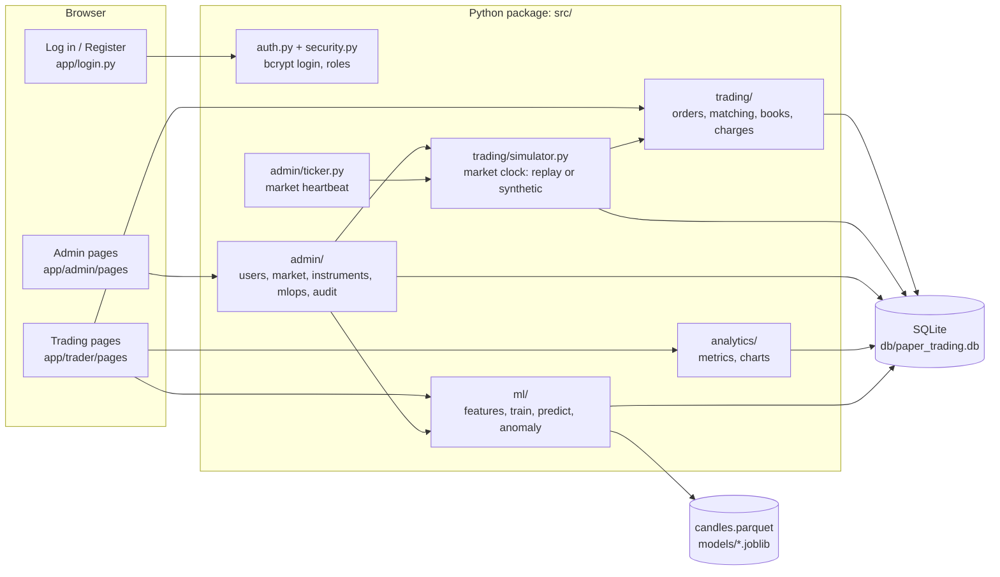
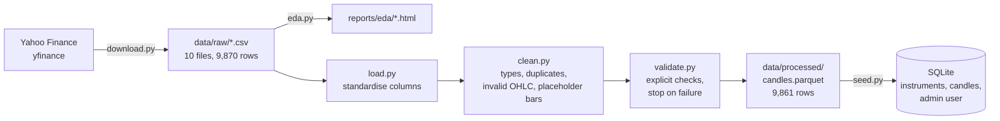
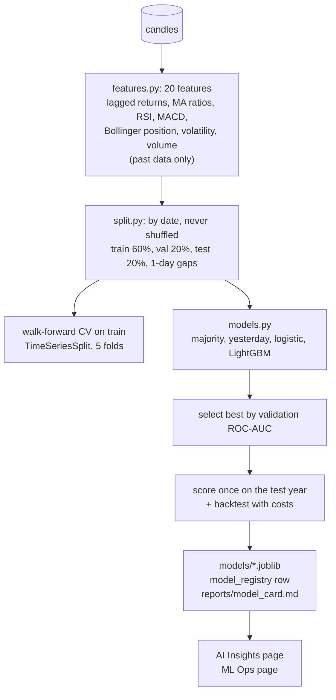

# PaperDesk: Paper Trading & Portfolio Analytics Platform

An educational, OpenAlgo-style paper-trading platform written entirely in Python.
Traders get virtual cash, place orders against replayed NSE market data, and see
their portfolio, P&L, risk metrics and machine-learning signals. A separate admin
dashboard manages users, the simulated market, instruments and ML models, and
records every admin action.

> [!WARNING]
> **Educational project. Not financial advice.** No real broker, no real money and
> no paid APIs are used. Prices are historical (or randomly generated) and every
> trade is simulated. The ML "signals" are experimental and, as the results below
> show, do **not** reliably beat simply buying and holding. Do not use anything
> here to make real investment decisions.

| Trader terminal | Analytics |
|---|---|
|  |  |
| **AI Insights** | **Admin pages: market control** |
|  |  |
| **Login** | |
|  | |

**One app for everyone.** Traders and admins use the same address (http://localhost:8501)
and the same login page, which also has **Register**. After login, the menu shows the pages
for your role: trading pages for traders, admin pages for admins.

**Design ("Night Desk").** Saffron amber marks the trading pages' brand and main actions,
violet marks the admin pages, blue is for data, and green/red appear only when money moves.
Headings and text use Plus Jakarta Sans, and numbers use JetBrains Mono so columns of
prices line up. All of it is Streamlit: the theme lives in `.streamlit/config.toml` and the
shared components (page header, market card, account card, empty states, order-ticket
styling) in `src/ui.py`.

---

## Contents
1. [Features](#features)
2. [Architecture](#architecture)
3. [Dataset](#dataset)
4. [Data pipeline](#data-pipeline)
5. [ML pipeline and results](#ml-pipeline-and-results)
6. [Setup on Windows](#setup-on-windows)
7. [Running](#running)
8. [Tests](#tests)
9. [Project structure](#project-structure)
10. [Configuration](#configuration)
11. [Limitations](#limitations)
12. [Credits and licences](#credits-and-licences)

---

## Features

### Trading pages (for traders)
- **Login and registration** with bcrypt-hashed passwords, roles (trader / admin) and
  disabled accounts. Every new trader starts with **₹10,00,000** of virtual cash.
- **Trading terminal**: live-refreshing watchlist (▲/▼ change), candlestick chart with
  20/50-day moving averages and volume (today's candle grows live in intraday mode), and an order form.
- **Intraday mode**: each trading day plays out in 75 five-minute steps from 09:15 to 15:30.
  Prices follow a random path (a Brownian bridge) that is pinned to the day's real open, high,
  low and close, with U-shaped volume. Traders only ever see the day so far, and MIS positions
  get real intraday profit and loss before the automatic 15:15 square-off.
- **Order types** MARKET, LIMIT, SL and SL-M; **products** CNC (delivery) and MIS
  (intraday, 5× leverage, auto square-off at the day's close). Margin is blocked on
  placement and released on fill or cancel; brokerage, STT, exchange fees, SEBI fee,
  stamp duty and GST are charged per fill. Large orders fill partially against bar volume.
- **Orders** (modify / cancel), **Trades**, **Positions** (live P&L), **Holdings**,
  **Funds**, with CSV downloads for orders and trades.
- **Analytics**: total and day P&L, win rate, profit factor, max drawdown, Sharpe ratio,
  historical **VaR and CVaR (95%)**, equity curve, drawdown chart, P&L by stock and a
  daily P&L calendar heatmap.
- **AI Insights**: the active model's up/down signal and probability per stock (computed
  only from prices up to the market date), its test metrics against baselines, feature
  importance, and its backtest against buy-and-hold.

### Admin pages (for admin accounts, same app)
- **Overview**: traders, active today, orders and traded value, platform P&L, charts over time.
- **Users**: search, view any trader's portfolio and trades, top up, reset, enable/disable.
- **Leaderboard** by total P&L or Sharpe ratio.
- **Market control**: start/pause automatic advancing, intraday (5-minute) or daily steps,
  speed, replay or synthetic mode, and volatility of synthetic prices.
- **Instruments**: add, edit, remove (instruments with history are deactivated, never deleted).
- **ML Ops**: model registry, one-click retrain, version comparison, choose the active
  version, and **anomaly flags** for unusual trading behaviour.
- **Audit log** of every admin action (including logins), with CSV download.

### OpenAlgo-style API
The trading engine exposes plain Python functions named after
[OpenAlgo](https://github.com/marketcalls/openalgo)'s API, returning the same
response shapes (`{"status": "success", "data": ...}`):
`placeorder`, `modifyorder`, `cancelorder`, `orderbook`, `tradebook`, `positionbook`,
`holdings`, `funds`, `quotes`, `history`.

```python
from src.trading import placeorder, funds
placeorder(session, user_id, "TCS", "NSE", "BUY", 10, pricetype="LIMIT", product="CNC", price=3500)
funds(session, user_id)["data"]["availablecash"]
```

---

## Architecture



**Key ideas**
- **One app, menus by role** (`app/main.py`): a single address and login. The menu is
  built from the logged-in role, so a trader's session simply has no admin pages.
- **One simulated clock** (`sim_clock` table) shared by every page and every user. Every
  price lookup is "latest candle at or before now", so the apps and the ML signals can
  never see the future. Mid-session (intraday mode), today's daily candle is replaced by
  the part of the day that has happened so far, and the ML model only sees finished days.
- **Thin UI, testable core**: the Streamlit pages only draw; all rules live in `src/`
  as plain functions that the tests call directly.
- **Defence in depth for admin actions**: the app only registers admin pages for
  admins, *and* every function in `src/admin/` re-checks the caller's role (raising
  `PermissionError`) and writes an `admin_log` row in the same transaction as the change.

**Database tables** (SQLAlchemy, `src/db/models.py`): `users`, `funds`, `instruments`,
`candles`, `orders`, `trades`, `positions`, `holdings`, `daily_pnl`, `admin_log`,
`model_registry`, `sim_clock`.

---

## Dataset

| | |
|---|---|
| Source | Yahoo Finance daily candles via the free `yfinance` package (`src/data/download.py`) |
| Stocks | 10 large NIFTY 50 stocks from different sectors: RELIANCE, TCS, INFY, HDFCBANK, ICICIBANK, SBIN, ITC, HINDUNILVR, BHARTIARTL, LT |
| Period | 3 Jan 2022 – 30 Dec 2025, daily bars (~246 trading days a year) |
| Size | 9,870 raw rows → **9,861 clean rows** |
| Columns | symbol, exchange, timestamp, open, high, low, close, volume |
| Prices | As traded (split-adjusted, not dividend-adjusted), rounded to 2 decimals |

**What the EDA found** (`eda.py`, charts in `reports/eda/`):
- No missing values, duplicates or impossible prices, but **9 placeholder bars** on
  18 Mar 2025 (open = high = low = close, zero volume) for 9 of the 10 stocks. NSE was
  open that day, so these are vendor fillers; a cleaning rule now removes them.
- The largest daily moves match real events: SBIN −14.4% and LT −12.7% on
  4 Jun 2024 (election results), HDFCBANK +10% on 4 Apr 2022 (HDFC merger announcement).
- Best performers 2022–2025: BHARTIARTL (≈ +31% a year), LT and SBIN (≈ +22% a year);
  INFY, TCS and HINDUNILVR were roughly flat.

---

## Data pipeline



Every removed row is counted by reason and logged (`logs/pipeline.log`). The
validator re-checks the cleaned data (types, no gaps, OHLC consistency, uniqueness,
sort order) and raises a clear error listing every problem before anything is saved.

---

## ML pipeline and results

**Task:** for each stock and day, predict whether the **next** close will be higher
than today's (up = 1). Educational signals only.



**Guarding against look-ahead.** Features use only `shift(k ≥ 0)`, trailing rolling
windows and causal EMAs. A test recomputes every feature on data cut off at 23
different days and checks they match the full-history values; another triples all
future prices and checks the past features don't move. Planting a leak (a centred
window, or tomorrow's return as a feature) makes both tests fail.

**Results on the held-out test period (27 Mar – 29 Dec 2025, 1,870 rows):**

| Model | Walk-forward CV AUC | Validation AUC | **Test AUC** | Test accuracy | Backtest (after costs) |
|---|---|---|---|---|---|
| Majority-class baseline | 0.500 | 0.500 | 0.500 | 49.4% | +8.28% |
| Yesterday's-direction baseline | 0.491 | 0.494 | 0.482 | 48.2% | −8.02% |
| Logistic regression | 0.512 | 0.477 | 0.514 | 52.3% | +5.17% |
| **LightGBM (selected)** | 0.516 | **0.517** | 0.491 | 49.7% | +0.32% |
| Buy-and-hold | | | | | **+8.28%** |

**Interpretation.** LightGBM was chosen because it had the best validation AUC, but on the
unseen test year it scored no better than a coin flip (AUC 0.491). Logistic regression
looks slightly better on test, but choosing it *after* seeing test results would be
cheating, so the selection rule is kept. The trading signal is also eaten by costs
(≈0.11% per buy or sell, ~590 trades). This is the expected, honest outcome: the next-day
direction of large, liquid stocks is close to random. A result of 60%+ accuracy here would
more likely mean a data leak than a real edge. Full details: [`reports/model_card.md`](reports/model_card.md).
Training is reproducible (seed 42; two runs give identical numbers).

**Anomaly detection (admin ML Ops).** Each trader is described by trades per day, trade
size, largest trade vs account, daily P&L swings, worst day and rejected-order rate.
Two checks run side by side: an **IsolationForest** for users unusual in a *combination*
of ways, and a **robust z-score rule** (median / MAD) for a single extreme value. Tests
showed that with only ~10 traders the forest alone could not single out one extreme
trade, so both thresholds were calibrated by simulation. Over 200 simulated groups:
extreme trader caught 200/200, "unusual in every way" trader caught 200/200, and
0 of 1,800 normal traders falsely flagged.

---

## Setup on Windows

Requirements: Windows 10/11, **Python 3.11**, PowerShell, ~8 GB RAM, internet access
for the one-time data download.

```powershell
# 1. Get the code and create the virtual environment
git clone https://github.com/sahana913/Trading_App.git
cd Trading_App
python -m venv .venv
.venv\Scripts\python.exe -m pip install -r requirements.txt

# 2. Download the data (10 NSE stocks, 2022-2025) into data\raw\
.venv\Scripts\python.exe -m src.data.download

# 3. Explore it (prints a report, saves charts to reports\eda\)
.venv\Scripts\python.exe eda.py

# 4. Clean and validate it (writes data\processed\candles.parquet)
.venv\Scripts\python.exe -m src.data.pipeline

# 5. Create the database and the admin account (choose your own password)
$env:ADMIN_PASSWORD = "choose-a-strong-password"
.venv\Scripts\python.exe -m src.db.seed
Remove-Item Env:ADMIN_PASSWORD

# 6. Train the ML models (about 15 seconds)
.venv\Scripts\python.exe -m src.ml.train
```

---

## Running

Start PaperDesk (one window):

```powershell
powershell -ExecutionPolicy Bypass -File .\run.ps1
```

or, without the script:

```powershell
.venv\Scripts\python.exe -m streamlit run app/main.py
```

Then open **http://localhost:8501**:
- **Traders:** open the **Register** tab to create an account (₹10,00,000 of virtual cash), or log in.
- **Admins:** log in as `admin` (the password you chose for the seed command). The admin
  pages open in violet. Go to **Market control**, choose a start date and press
  **Start market**, then **▶ Start** to let the market advance on its own.

The market heartbeat runs inside the app, so the market advances while the app is running.

**Command-line market control** (no UI needed):

```powershell
.venv\Scripts\python.exe -m src.trading.simulator status
.venv\Scripts\python.exe -m src.trading.simulator start 2024-01-01
.venv\Scripts\python.exe -m src.trading.simulator run 20
.venv\Scripts\python.exe -m src.trading.simulator reset --yes
```

---

## Tests

```powershell
.venv\Scripts\python.exe -m pytest
```

**268 tests** (about 3 minutes) covering:
- data cleaning and validation, and the database models and seed;
- the trading engine: fills, partial fills, rejections, cancellations, margin, charges,
  P&L, and a "money is never created or lost" check;
- the simulator, including intraday mode (paths pinned to the real candle, no look-ahead
  at 11:00, real MIS P&L), analytics maths (hand-checked VaR, CVaR, Sharpe, drawdown), and
  the ML pipeline (look-ahead leakage, splits, reproducibility, backtest);
- the anomaly detector;
- both Streamlit apps, clicked through with Streamlit's `AppTest`, including **non-admins
  being blocked** from every admin page and every admin function.

---

## Project structure

```
app/
  main.py, login.py          The one PaperDesk app: login/register, then a menu built from your role
  trader/pages/              Trading pages (Terminal, Orders, Trades, Positions, Holdings, Funds, Analytics, AI Insights)
  admin/pages/               Admin pages (Overview, Users, Leaderboard, Market control, Instruments, ML Ops, Audit log)
src/
  data/       download, load, clean, validate, pipeline
  db/         SQLAlchemy models, session (with a small column migration helper), seed
  trading/    OpenAlgo-style engine: orders, matching, books, charges, market data, simulator, synthetic prices
  analytics/  P&L and risk metrics, Plotly charts
  ml/         features, splits, models, evaluation, backtest, training, prediction, anomaly detection
  admin/      admin actions (all audited), statistics, market heartbeat
  auth.py, security.py, ui.py, config.py
tests/        pytest suite
eda.py        exploratory data analysis
run.ps1       start PaperDesk (one app on :8501)
reports/      model_card.md (committed), eda/ (generated)
docs/         screenshots
```

---

## Configuration

Everything adjustable lives in [`src/config.py`](src/config.py), including:
- `STARTING_CASH` (₹10,00,000) and `MARGIN_RATE` (CNC 100%, MIS 20%);
- `MAX_VOLUME_PCT`, the share of a bar's volume one order can fill (partial fills);
- `SQUARE_OFF_TIME`, when MIS positions are closed;
- `TRADER_CAN_MOVE_CLOCK`: set to `False` so only admins move the market;
- `MA_WINDOWS` and `WATCHLIST_REFRESH_SECONDS`.

Charges are in [`src/trading/charges.py`](src/trading/charges.py) and the ML settings in
[`src/ml/`](src/ml/). The environment variable `PAPER_TRADING_DB_URL` points the apps at
a different database (the tests use it).

---

## Limitations
- **Simulated intraday prices.** Intraday mode invents the path inside each real daily
  candle; only the open, high, low and close are real. In daily mode MIS trades open and
  close at the same price, so use intraday mode for them.
- **Simplified execution.** Fills happen at the bar's close; SL orders don't remember
  being triggered; there's no order book, slippage or T+1 settlement.
- **Small sample.** 10 stocks over 4 years is little data for ML or risk conclusions;
  Sharpe and VaR over a few weeks are unreliable.
- **Top-ups count as capital**, so total P&L is right but the daily P&L chart shows the
  top-up day as a jump.
- **Auto-advance needs the app running** (the market heartbeat lives inside it).
- SQLite suits a single machine and a handful of users, not production load.

---

## Credits and licences
- **[OpenAlgo](https://github.com/marketcalls/openalgo)** by marketcalls, licensed under
  **AGPL-3.0**. This project follows OpenAlgo's API *conventions* only: its function names
  (`placeorder`, `orderbook`, `funds`...), order/product types and response shapes. **No
  OpenAlgo source code is included, copied or modified here**; the engine is an independent
  implementation, and this project is not affiliated with or endorsed by OpenAlgo. If you
  ever copy OpenAlgo code into this project, the combined work must be released under
  AGPL-3.0, including offering the source to users who interact with it over a network.
- **Market data** from Yahoo Finance through the open-source
  [`yfinance`](https://github.com/ranaroussi/yfinance) package, for personal and
  educational use under Yahoo's terms. The raw CSVs in `data/raw/` are committed so
  results are reproducible; Yahoo's terms restrict redistributing its data, so for a
  public repository consider removing `data/raw/` from git (`src/data/download.py`
  recreates it).
- Built with pandas, NumPy, pyarrow, SQLAlchemy, scikit-learn, LightGBM, Plotly,
  Streamlit, bcrypt and pytest.
- **This project's licence:** none has been chosen yet, so all rights are reserved by the
  author until a `LICENSE` file is added.
